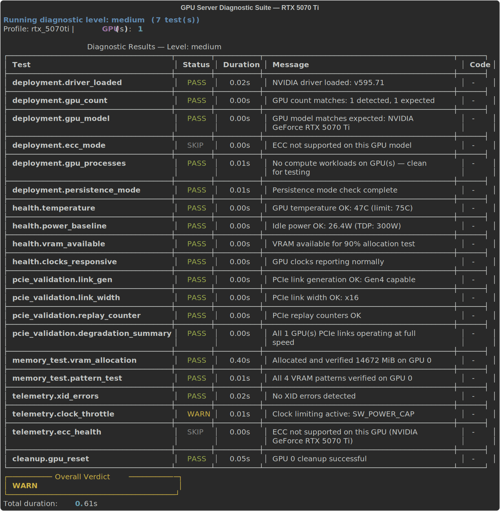

# GPU Server Diagnostic Test Suite

Production-grade GPU validation framework modeled on [NVIDIA DCGM](https://developer.nvidia.com/dcgm) architecture. Runs multi-level hardware diagnostics, exports Prometheus metrics, and integrates with Grafana for real-time monitoring.

Built for data center reliability teams, ML infrastructure engineers, and GPU fleet operators.



---

## Features

- **Multi-level diagnostics** — Quick (deployment checks), Medium (+ PCIe, memory, telemetry), Long (+ bandwidth, stress, topology), Extended (+ NCCL, burn-in)
- **16 diagnostic modules** — Driver validation, GPU enumeration, PCIe gen/width/replay, VRAM allocation, pattern verification, XID errors, ECC health, clock throttling, compute stress, memory bandwidth, NVLink P2P, topology mapping, and more
- **Prometheus metrics exporter** — Real-time GPU telemetry on `:9835/metrics` via `prometheus_client`; compatible with any standard Prometheus scraper
- **Live GPU health monitor** — `monitor` command renders a continuously-refreshed Rich table (temperature, power, VRAM, clocks) at a configurable poll interval
- **Run history** — Every `diag` invocation appends a summary entry to `reports/.run_history.jsonl`; the `history` command displays it as a table with pass/fail filtering
- **Fault injection** — Five synthetic fault types (`thermal`, `ecc`, `pcie`, `clock`, `memory`) via `--inject-fault`; failure codes use the `DIAG-FI-*` prefix to distinguish injected faults from real diagnostic failures
- **Docker Compose stack** — One-command deployment with Prometheus + Grafana (auto-provisioned dashboards)
- **Hardware profiles** — Per-GPU threshold configs (RTX 5070 Ti, A100 80GB, H100 SXM included)
- **Burn-in mode** — Continuous stress testing with configurable duration (up to 24h)
- **CI/CD integration** — JUnit XML output, GitHub Actions pipeline, ruff linting
- **Rich CLI** — Colored terminal output with progress tables

---

## Quick Start

```bash
# Install
pip install -e ".[dev]"

# GPU inventory
python -m src.main inventory

# Run diagnostics
python -m src.main diag --level quick        # Deployment checks only (~1s)
python -m src.main diag --level medium       # + PCIe, memory, telemetry (~5s)
python -m src.main diag --level long         # + bandwidth, stress, topology (~30s)
python -m src.main diag --level extended     # + NCCL, burn-in (~60s)

# Run a single named test
python -m src.main diag --test xid_errors

# Export results
python -m src.main diag --level long --output json
python -m src.main diag --level long --output junit --junit-file results.xml

# Burn-in mode (stress test for specified duration)
python -m src.main diag --mode burnin --duration 3600

# Pre-flight check before a training job
python -m src.main diag --level medium --mode preflight

# Inject a synthetic fault to verify failure handling
python -m src.main diag --level quick --inject-fault thermal

# Live GPU health monitor (Ctrl+C to stop)
python -m src.main monitor --interval 5

# View recent diagnostic run history
python -m src.main history
python -m src.main history --failures        # Failed runs only
python -m src.main history --limit 50

# Start standalone Prometheus metrics server
python -m src.main metrics --port 9835

# GPU cleanup (reset clocks, power, CUDA context)
python -m src.main cleanup
```

---

## Docker Compose

Full observability stack with one command:

```bash
docker compose up -d
```

| Service    | Port | Description                           |
|------------|------|---------------------------------------|
| gpu-diag   | 9835 | Prometheus metrics exporter           |
| Prometheus | 9090 | Metrics storage and alerting          |
| Grafana    | 3000 | Dashboard visualization (admin/admin) |

Requires [NVIDIA Container Toolkit](https://docs.nvidia.com/datacenter/cloud-native/container-toolkit/latest/install-guide.html).

---

## Architecture

```
src/
├── main.py                  # CLI entry point (click-based)
├── diagnostics/             # 16 diagnostic modules
│   ├── deployment.py        # Driver, GPU count, model, ECC, persistence
│   ├── gpu_health.py        # Temperature, power, VRAM, clock responsiveness
│   ├── pcie_validation.py   # Gen, width, replay counters, degradation
│   ├── pcie_bandwidth.py    # Host-to-device / device-to-host throughput
│   ├── memory_test.py       # VRAM allocation + pattern verification
│   ├── memory_bandwidth.py  # HBM bandwidth measurement
│   ├── compute_stress.py    # SM occupancy stress test
│   ├── sm_stress.py         # Streaming multiprocessor saturation
│   ├── power_test.py        # Power draw under load
│   ├── ecc_health.py        # SBE/DBE error counters, row remapping
│   ├── xid_errors.py        # XID event log analysis
│   ├── clock_throttle.py    # Throttle reason detection
│   ├── nvlink_p2p.py        # NVLink peer-to-peer validation
│   ├── nccl_validation.py   # NCCL collective ops (simulated — see Platform Notes)
│   ├── topology_map.py      # PCIe/NVLink topology discovery
│   └── gpu_cleanup.py       # Post-test GPU state reset
├── inventory/               # GPU discovery and system info
├── monitoring/              # Placeholder — daemon-based monitoring
├── reporting/               # Prometheus, JUnit XML, history, test runner
│   ├── prometheus.py        # prometheus_client-backed metrics exporter
│   ├── history.py           # JSONL run history (save + load)
│   ├── junit_xml.py         # JUnit XML for CI/CD
│   ├── models.py            # TestResult, TestStatus, DiagnosticRun
│   └── test_runner.py       # Test orchestration
├── fault_injection/         # Synthetic fault simulation (5 fault types)
└── database/                # Placeholder — SQLAlchemy result persistence
```

---

## Diagnostic Levels

| Level    | Tests | Duration | Use Case                              |
|----------|-------|----------|---------------------------------------|
| quick    | 1     | ~1s      | Smoke test after provisioning         |
| medium   | 7     | ~5s      | Pre-job validation                    |
| long     | 14    | ~30s     | Scheduled health checks               |
| extended | 15    | ~60s     | Full qualification / burn-in          |

**Level contents:**

| Test Module       | quick | medium | long | extended |
|-------------------|:-----:|:------:|:----:|:--------:|
| deployment        | ✓     | ✓      | ✓    | ✓        |
| gpu_health        |       | ✓      | ✓    | ✓        |
| pcie_validation   |       | ✓      | ✓    | ✓        |
| memory_test       |       | ✓      | ✓    | ✓        |
| xid_errors        |       | ✓      | ✓    | ✓        |
| clock_throttle    |       | ✓      | ✓    | ✓        |
| ecc_health        |       | ✓      | ✓    | ✓        |
| topology_map      |       |        | ✓    | ✓        |
| pcie_bandwidth    |       |        | ✓    | ✓        |
| memory_bandwidth  |       |        | ✓    | ✓        |
| compute_stress    |       |        | ✓    | ✓        |
| sm_stress         |       |        | ✓    | ✓        |
| power_test        |       |        | ✓    | ✓        |
| nvlink_p2p        |       |        | ✓    | ✓        |
| nccl_validation   |       |        |      | ✓        |

---

## Execution Modes

| Mode      | Description                            | Stress Duration |
|-----------|----------------------------------------|-----------------|
| standard  | Normal test execution (default)        | Profile default |
| preflight | Pre-job health check, shorter stress   | 30s             |
| burnin    | New hardware qualification             | Configurable    |

```bash
# Pre-flight check before a training job
python -m src.main diag --level medium --mode preflight

# 8-hour burn-in for new hardware
python -m src.main diag --level extended --mode burnin --duration 28800
```

---

## Fault Injection

The `--inject-fault` flag appends a synthetic `FAIL` result to the diagnostic run, allowing you to verify that alerting pipelines, JUnit reporting, and CI failure gates respond correctly without requiring actual hardware faults.

```bash
python -m src.main diag --level quick --inject-fault thermal
python -m src.main diag --level quick --inject-fault ecc
python -m src.main diag --level quick --inject-fault pcie
python -m src.main diag --level quick --inject-fault clock
python -m src.main diag --level quick --inject-fault memory
```

Injected results carry `DIAG-FI-*` failure codes, which are distinct from real diagnostic codes and can be filtered in alert rules.

| Fault    | Simulated Condition                              | Failure Code  |
|----------|--------------------------------------------------|---------------|
| thermal  | GPU temperature 95°C, exceeding 85°C threshold  | DIAG-FI-300   |
| ecc      | Double-bit ECC error (DBE count = 1)            | DIAG-FI-401   |
| pcie     | PCIe link degraded to Gen4 x8 (expected x16)    | DIAG-FI-202   |
| clock    | Clock throttle: SW_THERMAL_SLOWDOWN active       | DIAG-FI-501   |
| memory   | VRAM stress failure at iteration 512             | DIAG-FI-102   |

---

## Failure Codes

Real diagnostic failures use numeric codes to identify the specific check that failed:

| Code     | Check                        | Module         |
|----------|------------------------------|----------------|
| DIAG-001 | Driver not loaded            | deployment     |
| DIAG-002 | GPU count mismatch           | deployment     |
| DIAG-003 | GPU model mismatch           | deployment     |
| DIAG-004 | ECC mode mismatch            | deployment     |
| DIAG-100 | VRAM allocation failure      | memory_test    |
| DIAG-200 | PCIe link degradation        | pcie_validation|
| DIAG-300 | Temperature threshold breach | gpu_health     |
| DIAG-400 | ECC error (SBE)              | ecc_health     |
| DIAG-401 | ECC error (DBE)              | ecc_health     |
| DIAG-500 | Clock throttle detected      | clock_throttle |
| DIAG-600 | Compute stress failure       | compute_stress |
| DIAG-FI-*| Injected fault (test only)   | fault_injection|

---

## Run History

Every `diag` run appends a one-line JSON entry to `reports/.run_history.jsonl`. The `history` command reads this file and renders a summary table:

```
$ python -m src.main history

        Diagnostic Run History
┌────────────────────┬──────────┬────────┬────────┬───────┬────────┬────────┬──────────┐
│ Timestamp          │ Run ID   │ Level  │ Status │ Tests │ Failed │ Warned │ Duration │
├────────────────────┼──────────┼────────┼────────┼───────┼────────┼────────┼──────────┤
│ 2026-03-24T09:14:02│ a3f1b2c4 │ medium │  PASS  │ 7     │ 0      │ 0      │ 4.8s     │
│ 2026-03-24T08:55:17│ 91d7e6a0 │ quick  │  FAIL  │ 6     │ 1      │ 0      │ 0.9s     │
└────────────────────┴──────────┴────────┴────────┴───────┴────────┴────────┴──────────┘
```

Entries are stored in reverse-chronological order. Use `--failures` to filter to failed runs only, and `--limit N` to control how many entries are shown (default: 20).

---

## Prometheus Metrics

Exported at `http://localhost:9835/metrics` using `prometheus_client` (standard Prometheus exposition format):

```
# HELP gpu_temperature_celsius Current GPU temperature
# TYPE gpu_temperature_celsius gauge
gpu_temperature_celsius{gpu="0"} 47.0

# HELP gpu_power_draw_watts Current GPU power draw
# TYPE gpu_power_draw_watts gauge
gpu_power_draw_watts{gpu="0"} 30.9

# HELP gpu_memory_used_mib GPU VRAM usage in MiB
# TYPE gpu_memory_used_mib gauge
gpu_memory_used_mib{gpu="0"} 2054.0

# HELP gpu_diagnostic_status Diagnostic test status (1=pass, 0=fail, 2=warn, 3=skip)
# TYPE gpu_diagnostic_status gauge
gpu_diagnostic_status{test="deployment.driver_loaded",gpu_uuid=""} 1.0

# HELP gpu_diagnostic_run_total Total diagnostic runs
# TYPE gpu_diagnostic_run_total counter
gpu_diagnostic_run_total 3.0
```

Status values: `1` = PASS, `0` = FAIL, `2` = WARN, `3` = SKIP

The `/health` endpoint returns `{"status": "ok"}` for load balancer health checks.

---

## Alerting Rules

Pre-configured Prometheus alerts in `config/prometheus/alerts.yml`:

| Alert                  | Condition           | Severity |
|------------------------|---------------------|----------|
| GPUTemperatureCritical | > 85°C for 2m       | critical |
| GPUTemperatureWarning  | > 75°C for 5m       | warning  |
| GPUDiagnosticFailed    | Any test fails      | critical |
| GPUPowerExcessive      | > 290W for 2m       | warning  |
| GPUECCDoublebitError   | DBE count > 0       | critical |
| GPUECCSinglebitRising  | SBE rate > 0.1/hr   | warning  |

---

## Hardware Profiles

GPU-specific thresholds in `config/profiles/`:

```yaml
# config/profiles/rtx_5070ti.yaml
gpu_model: "NVIDIA GeForce RTX 5070 Ti"
gpu_count: 1
pcie_gen_expected: 4
pcie_width_expected: 16
temp_warning_c: 80
temp_critical_c: 89
power_limit_w: 300
```

Included profiles: RTX 5070 Ti, A100 80GB SXM, H100 SXM.

---

## Testing

```bash
pytest tests/                  # 157 tests, 0 warnings
ruff check src/ tests/         # Lint (all checks pass)
```

The test suite covers all diagnostic modules, the test runner, JUnit/Prometheus output, run level configuration, and telemetry checks. `PytestCollectionWarning` suppression is configured in `pyproject.toml`.

---

## CI/CD

GitHub Actions runs on every push/PR to `master`:
- Ruff linting
- Full test suite on Python 3.10 and 3.12
- JUnit XML artifact upload

---

## Requirements

| Package             | Purpose                                   |
|---------------------|-------------------------------------------|
| `nvidia-ml-py`      | pynvml bindings for GPU hardware access   |
| `psutil`            | CPU, RAM, and OS system info              |
| `click`             | CLI framework                             |
| `pyyaml`            | Hardware profile configuration            |
| `rich`              | Terminal output tables and live display   |
| `torch`             | Compute stress and memory bandwidth tests |
| `prometheus-client` | Prometheus exposition format exporter     |
| `sqlalchemy`        | Database layer (placeholder, not active)  |
| `psycopg2-binary`   | PostgreSQL driver (placeholder)           |

- Python 3.10+
- NVIDIA GPU with driver installed
- Docker + NVIDIA Container Toolkit (for containerized deployment)

---

## Platform Notes

**Windows (WDDM):** On Windows, `nvmlDeviceGetComputeRunningProcesses` returns all processes with a GPU context — including the desktop compositor, browsers, and system UI — not just CUDA workloads. The `gpu_processes` check filters to processes consuming >100 MB VRAM to correctly distinguish compute workloads from display processes. On Linux servers this filter has no effect.

**ECC:** Consumer GPUs (GeForce series) do not support ECC. `deployment.ecc_mode` and `telemetry.ecc_health` report SKIP on these devices — this is expected behavior, not a fault.

**Clock throttle:** App-clock-limiting (`clocks_event_reason_applications_clocks_setting`) on consumer GPUs reflects user-configured application clock caps, not a hardware fault. This state is classified as PASS.

**NCCL validation (simulated):** `nccl_validation.py` runs an in-process simulation of AllReduce and AllGather — it measures PCIe P2P bandwidth between GPUs but does not initialize `torch.distributed` or invoke the NCCL library. True NCCL collective op benchmarking requires multi-process execution (`torchrun`/`mpirun`) on a multi-GPU node. The current test validates computation correctness and raw P2P throughput; full NCCL integration is a planned enhancement.

**Database persistence:** The `database/` directory and `sqlalchemy`/`psycopg2-binary` dependencies are included for a planned SQLAlchemy persistence layer. File-based run history is available now via `reports/.run_history.jsonl`.

---

## License

MIT
