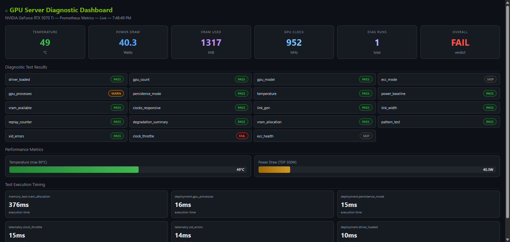

# GPU Server Diagnostic Test Suite

Production-grade GPU validation framework modeled on [NVIDIA DCGM](https://developer.nvidia.com/dcgm) architecture. Runs multi-level hardware diagnostics, exports Prometheus metrics, and integrates with Grafana for real-time monitoring.

Built for data center reliability teams, ML infrastructure engineers, and GPU fleet operators.



## Features

- **Multi-level diagnostics** — Quick (deployment checks), Medium (+ PCIe, memory, telemetry), Long (+ bandwidth, stress), Extended (+ burn-in)
- **17 diagnostic tests** — Driver validation, GPU enumeration, PCIe gen/width/replay, VRAM allocation, pattern verification, XID errors, ECC health, clock throttling, compute stress, memory bandwidth, NVLink P2P
- **Prometheus metrics exporter** — Real-time GPU telemetry on `:9835/metrics` with CORS support
- **Docker Compose stack** — One-command deployment with Prometheus + Grafana (auto-provisioned dashboards)
- **Hardware profiles** — Per-GPU threshold configs (RTX 5070 Ti, A100 80GB, H100 SXM included)
- **Fault injection** — Simulate thermal, power, and memory faults for validation testing
- **Burn-in mode** — Continuous stress testing with configurable duration
- **CI/CD integration** — JUnit XML output, GitHub Actions pipeline, ruff linting
- **Rich CLI** — Colored terminal output with progress tables via Rich

## Quick Start

```bash
# Install
pip install -e ".[dev]"

# Run diagnostics
python -m src.main diag --level quick        # Deployment checks only (~1s)
python -m src.main diag --level medium       # + PCIe, memory, telemetry (~5s)
python -m src.main diag --level long         # + bandwidth, stress tests (~30s)

# GPU inventory
python -m src.main inventory

# Prometheus metrics server
python -m src.main metrics --port 9835

# Export results
python -m src.main diag --level long --output json
python -m src.main diag --level long --output junit --junit-file results.xml
```

## Docker Compose

Full observability stack with one command:

```bash
docker compose up -d
```

| Service  | Port  | Description                          |
|----------|-------|--------------------------------------|
| gpu-diag | 9835  | Prometheus metrics exporter          |
| Prometheus | 9090 | Metrics storage and alerting        |
| Grafana  | 3000  | Dashboard visualization (admin/admin)|

Requires [NVIDIA Container Toolkit](https://docs.nvidia.com/datacenter/cloud-native/container-toolkit/latest/install-guide.html).

## Architecture

```
src/
├── main.py                  # CLI entry point (click-based)
├── diagnostics/             # 17 test modules
│   ├── deployment.py        # Driver, GPU count, model, ECC, persistence
│   ├── pcie_validation.py   # Gen, width, replay counters, degradation
│   ├── pcie_bandwidth.py    # Host-to-device / device-to-host throughput
│   ├── memory_test.py       # VRAM allocation + pattern verification
│   ├── memory_bandwidth.py  # HBM bandwidth measurement
│   ├── gpu_health.py        # Temperature, power, utilization
│   ├── compute_stress.py    # SM occupancy stress test
│   ├── sm_stress.py         # Streaming multiprocessor saturation
│   ├── power_test.py        # Power draw under load
│   ├── ecc_health.py        # SBE/DBE error counters
│   ├── xid_errors.py        # XID event log analysis
│   ├── clock_throttle.py    # Throttle reason detection
│   ├── nvlink_p2p.py        # NVLink peer-to-peer validation
│   ├── nccl_validation.py   # NCCL collective ops testing
│   └── topology_map.py      # PCIe/NVLink topology discovery
├── inventory/               # GPU discovery and system info
├── monitoring/              # Continuous health monitoring
├── reporting/               # Prometheus, JUnit XML, test runner
├── fault_injection/         # Controlled fault simulation
└── database/                # Result persistence (SQLAlchemy)
```

## Diagnostic Levels

| Level    | Tests | Duration | Use Case                        |
|----------|-------|----------|---------------------------------|
| quick    | 1     | ~1s      | Smoke test after provisioning   |
| medium   | 4     | ~5s      | Pre-job validation              |
| long     | 7     | ~30s     | Scheduled health checks         |
| extended | 8     | ~60s     | Full qualification              |

## Prometheus Metrics

Exported at `http://localhost:9835/metrics`:

```
gpu_temperature_celsius{gpu="0"} 47
gpu_power_draw_watts{gpu="0"} 30.9
gpu_memory_used_mib{gpu="0"} 2054
gpu_clock_graphics_mhz{gpu="0"} 1057
gpu_diagnostic_status{test="deployment.driver_loaded"} 1
gpu_diagnostic_duration_seconds{test="memory_test.vram_alloc"} 0.390
gpu_diagnostic_run_total 3
```

Status codes: `1` = PASS, `0` = FAIL, `2` = WARN, `3` = SKIP

## Alerting Rules

Pre-configured Prometheus alerts in `config/prometheus/alerts.yml`:

| Alert                   | Condition          | Severity |
|-------------------------|--------------------|----------|
| GPUTemperatureCritical  | > 85°C for 2m      | critical |
| GPUTemperatureWarning   | > 75°C for 5m      | warning  |
| GPUDiagnosticFailed     | Any test fails      | critical |
| GPUPowerExcessive       | > 290W for 2m       | warning  |
| GPUECCDoublebitError    | DBE count > 0       | critical |
| GPUECCSinglebitRising   | SBE rate > 0.1/hr   | warning  |

## Hardware Profiles

GPU-specific thresholds in `config/profiles/`:

```yaml
# config/profiles/rtx_5070ti.yaml
gpu_model: "NVIDIA GeForce RTX 5070 Ti"
gpu_count: 1
pcie_gen_expected: 4
pcie_width_expected: 16
temp_warning_c: 80
temp_critical_c: 89
power_limit_w: 300
```

Included profiles: RTX 5070 Ti, A100 80GB SXM, H100 SXM.

## Testing

```bash
pytest tests/ -v               # 154 tests
ruff check src/ tests/         # Lint
```

## CI/CD

GitHub Actions runs on every push/PR to `master`:
- Ruff linting
- Full test suite on Python 3.10 and 3.12
- JUnit XML artifact upload

## Requirements

- Python 3.10+
- NVIDIA GPU with driver installed
- `pynvml`, `psutil`, `click`, `pyyaml`, `rich`
- Docker + NVIDIA Container Toolkit (for containerized deployment)

## License

MIT
